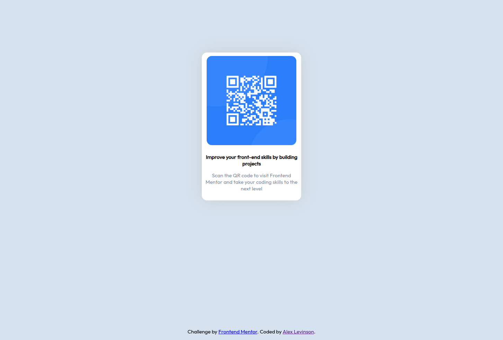

# Frontend Mentor - QR code component solution

This is a solution to the [QR code component challenge on Frontend Mentor](https://www.frontendmentor.io/challenges/qr-code-component-iux_sIO_H). Frontend Mentor challenges help you improve your coding skills by building realistic projects. 

## Table of contents

- [Overview](#overview)
  - [Screenshot](#screenshot)
  - [Links](#links)
- [My process](#my-process)
  - [Built with](#built-with)
  - [What I learned](#what-i-learned)
  - [Useful resources](#useful-resources)
- [Author](#author)

## Overview

### Screenshot

Desktop Photo

### Links

- Solution URL: [Add solution URL here](https://your-solution-url.com)
- Live Site URL: [Add live site URL here](https://your-live-site-url.com)

## My process

### Built with

- Semantic HTML5 markup
- CSS custom properties
- Flexbox

### What I learned
I learned about using CSS and divs to position an element on a page the right way/

### Continued development

I want to keep learning about positioning elements on a page, which has always been a weak spot for me when it comes to HTML and CSS

### Useful resources

- [W3 Schools](https://www.w3schools.com/css) - This helped me with CSS elements and properties
- [Interactive Guide to Flexbox](https://www.joshwcomeau.com/css/interactive-guide-to-flexbox/) - An amazing visual guide to flexbox.

## Author

- Website - [Alex Levinson](https://alcl00.github.io/)
- Frontend Mentor - [@yourusername](https://www.frontendmentor.io/profile/alcl00)
